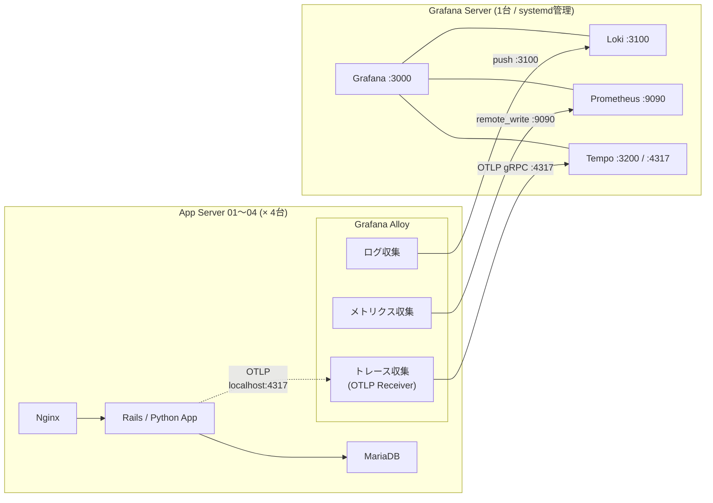
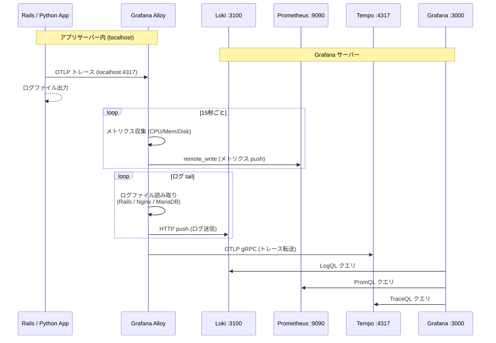
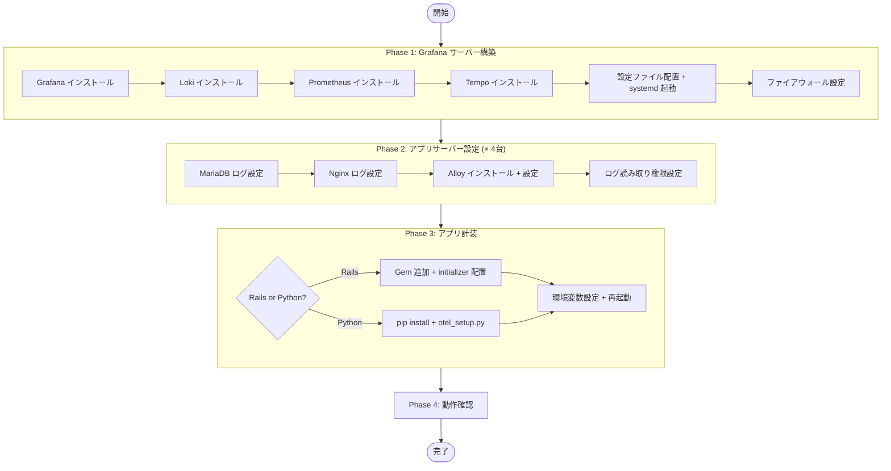
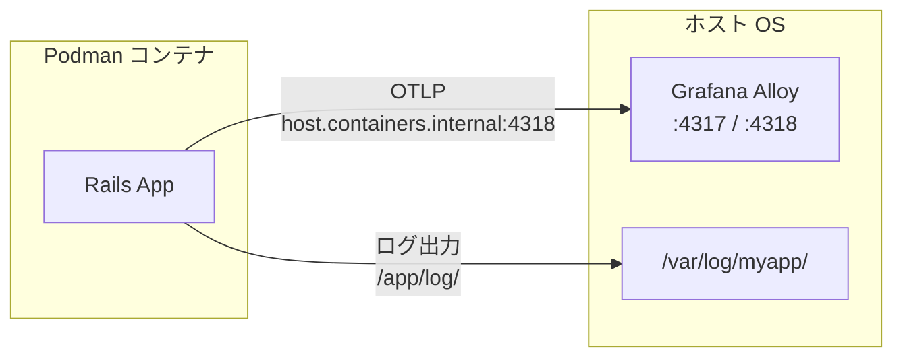
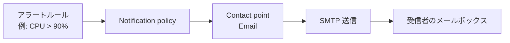

# Grafana Observability Stack 構築手順書（Docker 不使用）

## 構成概要

| サーバー | 役割 | 台数 |
|----------|------|------|
| Grafana サーバー | Grafana + Loki + Prometheus + Tempo（すべてネイティブ） | 1台 |
| アプリサーバー | Rails/Python + Nginx + MariaDB + Alloy | 4台 |

### アーキテクチャ図



### ファイアウォール要件

| 方向 | ポート | 用途 |
|------|--------|------|
| App → Grafana | 3100 | Loki（ログ push） |
| App → Grafana | 9090 | Prometheus（remote_write） |
| App → Grafana | 4317 | Tempo（OTLP gRPC） |
| App 内 localhost | 4317, 4318 | Alloy OTLP 受信 |
| 管理者 → Grafana | 3000 | Grafana Web UI |
| 管理者 → App | 12345 | Alloy 管理 UI（任意） |

### データフロー図



### セットアップフロー



---

## Phase 1: Grafana サーバーの構築

### 1.1 ファイルの転送

同梱の `grafana-server/` ディレクトリをサーバーに転送します。

```bash
scp -r grafana-server/ user@grafana-server:/tmp/grafana-stack/
```

ディレクトリ構成：
```
grafana-server/
├── install_grafana_stack.sh        # 自動インストールスクリプト
├── config/
│   ├── loki-config.yaml            # Loki 設定
│   ├── prometheus.yml              # Prometheus 設定
│   ├── tempo.yaml                  # Tempo 設定
│   └── datasources.yaml           # Grafana データソース自動登録
└── systemd/
    ├── loki.service                # Loki systemd ユニット
    ├── prometheus.service          # Prometheus systemd ユニット
    └── tempo.service               # Tempo systemd ユニット
```

### 1.2 自動インストール（推奨）

```bash
ssh user@grafana-server
cd /tmp/grafana-stack
chmod +x install_grafana_stack.sh
sudo ./install_grafana_stack.sh
```

スクリプトが自動で以下を行います：
1. Grafana をパッケージマネージャからインストール
2. Loki / Prometheus / Tempo のバイナリをダウンロード・配置
3. 専用ユーザー（loki, prometheus, tempo）を作成
4. 設定ファイルと systemd ユニットファイルを配置
5. 全サービスを有効化・起動
6. ファイアウォールのポートを開放

### 1.3 手動インストール

自動スクリプトを使わない場合の手順です。

#### Grafana

```bash
# Debian/Ubuntu
sudo apt-get install -y apt-transport-https software-properties-common wget
sudo mkdir -p /etc/apt/keyrings/
wget -q -O - https://apt.grafana.com/gpg.key | gpg --dearmor | sudo tee /etc/apt/keyrings/grafana.gpg > /dev/null
echo "deb [signed-by=/etc/apt/keyrings/grafana.gpg] https://apt.grafana.com stable main" | sudo tee /etc/apt/sources.list.d/grafana.list
sudo apt-get update && sudo apt-get install -y grafana

# RHEL/Rocky
sudo rpm --import https://rpm.grafana.com/gpg.key
# /etc/yum.repos.d/grafana.repo を作成（スクリプト参照）
sudo dnf install -y grafana
```

#### Loki

```bash
# バイナリのダウンロード（バージョンは適宜変更）
LOKI_VERSION="3.4.2"
cd /tmp
wget "https://github.com/grafana/loki/releases/download/v${LOKI_VERSION}/loki-linux-amd64.zip"
unzip loki-linux-amd64.zip
chmod +x loki-linux-amd64
sudo mv loki-linux-amd64 /usr/local/bin/loki

# ユーザー・ディレクトリ作成
sudo useradd --system --no-create-home --shell /usr/sbin/nologin loki
sudo mkdir -p /etc/loki /var/lib/loki
sudo chown loki:loki /var/lib/loki

# 設定ファイルの配置
sudo cp config/loki-config.yaml /etc/loki/loki-config.yaml
sudo chown loki:loki /etc/loki/loki-config.yaml

# systemd ユニットの配置
sudo cp systemd/loki.service /etc/systemd/system/
sudo systemctl daemon-reload
sudo systemctl enable --now loki
```

#### Prometheus

```bash
PROM_VERSION="2.53.0"
cd /tmp
wget "https://github.com/prometheus/prometheus/releases/download/v${PROM_VERSION}/prometheus-${PROM_VERSION}.linux-amd64.tar.gz"
tar xzf "prometheus-${PROM_VERSION}.linux-amd64.tar.gz"
cd "prometheus-${PROM_VERSION}.linux-amd64"

sudo mv prometheus promtool /usr/local/bin/
sudo mkdir -p /etc/prometheus /var/lib/prometheus
sudo mv consoles console_libraries /etc/prometheus/

sudo useradd --system --no-create-home --shell /usr/sbin/nologin prometheus
sudo chown -R prometheus:prometheus /etc/prometheus /var/lib/prometheus

sudo cp /tmp/grafana-stack/config/prometheus.yml /etc/prometheus/
sudo chown prometheus:prometheus /etc/prometheus/prometheus.yml

sudo cp /tmp/grafana-stack/systemd/prometheus.service /etc/systemd/system/
sudo systemctl daemon-reload
sudo systemctl enable --now prometheus
```

> **重要**: prometheus.service の ExecStart に `--web.enable-remote-write-receiver` が含まれていることを確認してください。これがないと Alloy からの remote_write を受け付けません。

#### Tempo

```bash
TEMPO_VERSION="2.7.1"
cd /tmp
wget "https://github.com/grafana/tempo/releases/download/v${TEMPO_VERSION}/tempo_${TEMPO_VERSION}_linux_amd64.tar.gz"
tar xzf "tempo_${TEMPO_VERSION}_linux_amd64.tar.gz"
chmod +x tempo
sudo mv tempo /usr/local/bin/

sudo useradd --system --no-create-home --shell /usr/sbin/nologin tempo
sudo mkdir -p /etc/tempo /var/lib/tempo
sudo chown -R tempo:tempo /var/lib/tempo

sudo cp config/tempo.yaml /etc/tempo/
sudo chown tempo:tempo /etc/tempo/tempo.yaml

sudo cp systemd/tempo.service /etc/systemd/system/
sudo systemctl daemon-reload
sudo systemctl enable --now tempo
```

#### Grafana データソースの自動登録

```bash
sudo mkdir -p /etc/grafana/provisioning/datasources
sudo cp config/datasources.yaml /etc/grafana/provisioning/datasources/
sudo chown root:grafana /etc/grafana/provisioning/datasources/datasources.yaml

sudo systemctl enable --now grafana-server
```

### 1.4 起動確認

```bash
# 全サービスの状態確認
for svc in grafana-server loki prometheus tempo; do
  echo -n "${svc}: "
  sudo systemctl is-active "$svc"
done

# ポートの確認
ss -tlnp | grep -E ':(3000|3100|9090|3200|4317) '

# ヘルスチェック
curl -s http://localhost:3100/ready       # Loki
curl -s http://localhost:9090/-/ready     # Prometheus
curl -s http://localhost:3200/ready       # Tempo
curl -s http://localhost:3000/api/health  # Grafana
```

Grafana にアクセス: `http://<GRAFANA_SERVER_IP>:3000`
- 初期 ID/PW: `admin` / `admin`（初回ログイン時に変更を求められます）

---

## Phase 2: アプリサーバーのセットアップ（4台共通）

### 2.1 ファイルの転送

```bash
scp -r app-server/ user@app-server-01:/tmp/alloy-setup/
# 残り3台にも同様に転送
```

### 2.2 MariaDB のログ設定

```bash
sudo cp /tmp/alloy-setup/mariadb/99-logging.cnf /etc/mysql/mariadb.conf.d/

# ログディレクトリの確認
sudo mkdir -p /var/log/mysql
sudo chown mysql:mysql /var/log/mysql

# MariaDB 再起動
sudo systemctl restart mariadb

# ログの確認
sudo ls -la /var/log/mysql/
```

**設定内容:**
- エラーログ: `/var/log/mysql/error.log`
- スロークエリログ: `/var/log/mysql/slow-query.log`（1秒以上）

### 2.3 Nginx のログ設定（オプション: JSON化）

```bash
sudo cp /tmp/alloy-setup/nginx/logging.conf /etc/nginx/conf.d/

# JSON形式を使う場合は server ブロックで変更:
#   access_log /var/log/nginx/access.log json_combined;

sudo nginx -t && sudo systemctl reload nginx
```

> 標準の Combined Log Format でも Alloy で正しくパースされるため、JSON 化は任意です。

### 2.4 Grafana Alloy のインストール

```bash
cd /tmp/alloy-setup
chmod +x install_alloy.sh
sudo ./install_alloy.sh <GRAFANA_SERVER_IP>

# 例:
sudo ./install_alloy.sh 192.168.1.100
```

### 2.5 Alloy 設定の調整

```bash
sudo vim /etc/alloy/config.alloy
```

**サーバーごとに確認・変更する項目:**

| 項目 | デフォルト値 | 変更ポイント |
|------|-------------|-------------|
| Rails ログパス | `/var/www/myapp/log/production.log` | 実際のパスに変更 |
| Python ログパス | `/var/log/myapp/*.log` | 実際のパスに変更 |
| Nginx ログパス | `/var/log/nginx/access.log` | 通常そのまま |
| MariaDB ログパス | `/var/log/mysql/error.log` | 通常そのまま |
| アプリメトリクスポート | `localhost:9394` | Rails=9394, Python=8000 |
| 不要なセクション | Rails + Python 両方有効 | 使わない方をコメントアウト |

```bash
# 変更後に再起動
sudo systemctl restart alloy

# ログ確認
sudo journalctl -u alloy -f
```

---

## Phase 3: アプリケーションのトレース計装

### 3.1 Ruby on Rails

#### Gem の追加

```ruby
# Gemfile に追加
gem 'opentelemetry-sdk'
gem 'opentelemetry-exporter-otlp'
gem 'opentelemetry-instrumentation-all'
gem 'lograge'
gem 'prometheus_exporter'
```

```bash
bundle install
```

#### 初期化ファイルの配置

```bash
cp /tmp/alloy-setup/otel-rails/opentelemetry.rb config/initializers/
cp /tmp/alloy-setup/otel-rails/lograge.rb config/initializers/
```

#### 環境変数の設定

```bash
# .env, systemd の Environment, または export で設定
OTEL_SERVICE_NAME="myapp-rails"
OTEL_SERVICE_VERSION="1.0.0"
OTEL_EXPORTER_OTLP_ENDPOINT="http://localhost:4318/v1/traces"
```

#### Prometheus メトリクスの公開

```bash
# prometheus_exporter デーモンを起動（別プロセス）
bundle exec prometheus_exporter -b 0.0.0.0 -p 9394
```

```ruby
# config/initializers/prometheus.rb
unless Rails.env.test?
  require 'prometheus_exporter/middleware'
  Rails.application.middleware.unshift PrometheusExporter::Middleware
end
```

#### Rails アプリを再起動

```bash
# Puma の場合
sudo systemctl restart puma
# Unicorn の場合
sudo systemctl restart unicorn
```

### 3.1.1 Podman コンテナで動作する Rails アプリの場合

Rails アプリを Podman コンテナでデプロイしている場合は、ホスト上の Alloy と連携するための追加設定が必要です。



#### Dockerfile への Gem 追加

```dockerfile
# Gemfile に OTel 関連の gem を追加済みであること
# （3.1 の Gem の追加 を参照）
RUN bundle install
```

#### initializer ファイルの配置

コンテナイメージのビルド前に、ホストから initializer をコピーしておきます。

```bash
cp /tmp/alloy-setup/otel-rails/opentelemetry.rb /path/to/rails-app/config/initializers/
cp /tmp/alloy-setup/otel-rails/lograge.rb /path/to/rails-app/config/initializers/
```

#### 環境変数の設定

コンテナ内からホスト上の Alloy に接続するために、`host.containers.internal` を使用します。

```bash
# podman run で指定する場合
podman run -d \
  --name myapp-rails \
  -e OTEL_SERVICE_NAME="myapp-rails" \
  -e OTEL_SERVICE_VERSION="1.0.0" \
  -e OTEL_EXPORTER_OTLP_ENDPOINT="http://host.containers.internal:4318/v1/traces" \
  -e RAILS_ENV=production \
  -e RAILS_LOG_TO_STDOUT=false \
  -v /var/log/myapp:/app/log:Z \
  myapp-rails:latest
```

> **ポイント**: Podman では `host.containers.internal` がホストの IP に自動解決されます。
> Docker の `host-gateway` に相当する機能です。

#### Quadlet（systemd 管理）を使う場合

Podman コンテナを systemd で管理する場合は、Quadlet ファイルに環境変数とボリュームを記述します。

```ini
# ~/.config/containers/systemd/myapp-rails.container
# （rootless の場合。rootful は /etc/containers/systemd/ に配置）

[Container]
Image=myapp-rails:latest
ContainerName=myapp-rails

Environment=OTEL_SERVICE_NAME=myapp-rails
Environment=OTEL_SERVICE_VERSION=1.0.0
Environment=OTEL_EXPORTER_OTLP_ENDPOINT=http://host.containers.internal:4318/v1/traces
Environment=RAILS_ENV=production
Environment=RAILS_LOG_TO_STDOUT=false

# ログをホストのボリュームに出力（Alloy が読み取る）
Volume=/var/log/myapp:/app/log:Z

# Prometheus メトリクス用ポート（任意）
PublishPort=9394:9394

[Service]
Restart=always

[Install]
WantedBy=default.target
```

```bash
# Quadlet の反映
systemctl --user daemon-reload
systemctl --user start myapp-rails
systemctl --user enable myapp-rails
```

#### ログ収集の設定

コンテナ内のログをホストにマウントする方法（推奨）と、`podman logs` から収集する方法があります。

**方法 A: ボリュームマウント（推奨）**

Rails のログをファイル出力し、ホスト側にマウントします。Alloy の既存設定がそのまま利用できます。

```ruby
# config/environments/production.rb
config.logger = ActiveSupport::Logger.new(Rails.root.join("log", "production.log"))
```

Alloy の `config.alloy` のログパスがマウント先と一致していることを確認してください。

```
# config.alloy で確認
__path__ = "/var/log/myapp/production.log"
```

**方法 B: journald 経由（代替）**

Podman のログドライバを `journald` にして、Alloy の `loki.source.journal` で収集します。

```bash
# podman run 時に指定
podman run --log-driver=journald --name myapp-rails ...
```

Alloy はすでに `loki.source.journal "systemd"` を設定済みなので、追加設定不要で収集されます。
ただし、ログのパース（JSON 展開やラベル付与）を行いたい場合はパイプラインの追加が必要です。

#### メトリクスの公開

コンテナ内で `prometheus_exporter` を起動し、ポートを公開します。

```bash
podman run -d \
  -p 9394:9394 \
  ...
  myapp-rails:latest
```

Alloy の `prometheus.scrape "app_metrics"` がすでに `localhost:9394` を対象にしているため、追加設定は不要です。

#### 接続確認

```bash
# コンテナ内から Alloy への疎通確認
podman exec myapp-rails curl -s http://host.containers.internal:4318/v1/traces

# ホスト側でコンテナのログが出力されているか確認
ls -la /var/log/myapp/

# Alloy がログを読み取っているか確認
sudo journalctl -u alloy -f | grep myapp
```

### 3.2 Python アプリ

#### パッケージのインストール

```bash
pip install -r /tmp/alloy-setup/otel-python/requirements_otel.txt
```

#### otel_setup.py の配置

```bash
cp /tmp/alloy-setup/otel-python/otel_setup.py /path/to/your/app/
```

#### アプリへの組み込み

**Flask:**
```python
from flask import Flask
from otel_setup import init_telemetry

app = Flask(__name__)
init_telemetry(app, framework="flask")
```

**Django:**
```python
# settings.py の末尾
from otel_setup import init_telemetry
init_telemetry(framework="django")
```

**FastAPI:**
```python
from fastapi import FastAPI
from otel_setup import init_telemetry

app = FastAPI()
init_telemetry(app, framework="fastapi")
```

#### 環境変数の設定

```bash
OTEL_SERVICE_NAME="myapp-python"
OTEL_SERVICE_VERSION="1.0.0"
OTEL_EXPORTER_OTLP_ENDPOINT="localhost:4317"
DEPLOYMENT_ENV="production"
```

#### メトリクスの公開

```python
from prometheus_client import start_http_server
start_http_server(8000)  # /metrics を :8000 で公開
```

---

## Phase 4: 動作確認

### 4.1 各コンポーネントの状態確認

**Grafana サーバー:**
```bash
for svc in grafana-server loki prometheus tempo; do
  printf "%-20s : %s\n" "$svc" "$(sudo systemctl is-active $svc)"
done
```

**アプリサーバー:**
```bash
printf "%-20s : %s\n" "alloy" "$(sudo systemctl is-active alloy)"

# Alloy 管理 UI
curl -s http://localhost:12345/api/v0/web/components | python3 -m json.tool | head -30
```

### 4.2 Grafana でログを確認

Explore → データソース: **Loki**

```logql
# 全サーバーの Rails ログ
{job="rails"}

# 特定サーバーの Nginx アクセスログ
{job="nginx", log_type="access", host="app-server-01"}

# MariaDB スロークエリ
{job="mariadb", log_type="slow_query"}

# エラーログのみ
{job="rails"} | json | level="ERROR"

# Nginx の 5xx エラー
{job="nginx", log_type="access"} | regexp `"status":\s*"5\d\d"`
```

### 4.3 Grafana でメトリクスを確認

Explore → データソース: **Prometheus**

```promql
# CPU 使用率（全サーバー）
100 - (avg by (instance) (rate(node_cpu_seconds_total{mode="idle"}[5m])) * 100)

# メモリ使用率
100 * (1 - node_memory_MemAvailable_bytes / node_memory_MemTotal_bytes)

# ディスク使用率
100 - (node_filesystem_avail_bytes{mountpoint="/"} / node_filesystem_size_bytes{mountpoint="/"} * 100)

# ネットワーク受信量
rate(node_network_receive_bytes_total{device="eth0"}[5m])
```

### 4.4 Grafana でトレースを確認

Explore → データソース: **Tempo**

1. Search タブでサービス名（myapp-rails / myapp-python）を選択
2. トレースの一覧が表示される
3. クリックでウォーターフォール表示
4. ログにトレースIDが含まれていれば Loki へジャンプ可能

### 4.5 ログ ↔ トレースの連携確認

1. Loki でログを検索
2. ログ行の TraceID リンクをクリック
3. Tempo のトレースビューに自動遷移

---

## サービス管理コマンド集

### Grafana サーバー

```bash
# 状態確認
sudo systemctl status grafana-server loki prometheus tempo

# 再起動
sudo systemctl restart grafana-server
sudo systemctl restart loki
sudo systemctl restart prometheus
sudo systemctl restart tempo

# ログ確認
sudo journalctl -u loki -f
sudo journalctl -u prometheus -f
sudo journalctl -u tempo -f
sudo journalctl -u grafana-server -f

# 設定変更後の再読み込み
sudo systemctl reload prometheus          # Prometheus はリロード対応
sudo systemctl restart loki               # Loki は再起動が必要
sudo systemctl restart tempo              # Tempo は再起動が必要
sudo systemctl restart grafana-server     # Grafana は再起動が必要
```

### アプリサーバー

```bash
# Alloy の状態確認
sudo systemctl status alloy

# 再起動
sudo systemctl restart alloy

# ログ確認
sudo journalctl -u alloy -f

# 設定の書式チェック
alloy fmt /etc/alloy/config.alloy
```

---

## Grafana メール通知設定（SMTP）

アラートルールに基づいてメール通知を送信するには、Grafana の SMTP 設定が必要です。

### SMTP の設定

`/etc/grafana/grafana.ini` の `[smtp]` セクションを編集します。

```bash
sudo vim /etc/grafana/grafana.ini
```

```ini
[smtp]
enabled = true
host = smtp.example.com:587
user = grafana@example.com
password = """your-smtp-password"""
from_address = grafana@example.com
from_name = Grafana Alert
startTLS_policy = MandatoryStartTLS

# 自己署名証明書を使う場合のみ true（通常は false）
skip_verify = false
```

主要な SMTP プロバイダの設定例：

| プロバイダ | host | startTLS_policy | 備考 |
|-----------|------|-----------------|------|
| Gmail | `smtp.gmail.com:587` | `MandatoryStartTLS` | アプリパスワードが必要 |
| Amazon SES | `email-smtp.ap-northeast-1.amazonaws.com:587` | `MandatoryStartTLS` | IAM で SMTP 認証情報を発行 |
| さくら メールボックス | `<初期ドメイン>.sakura.ne.jp:587` | `MandatoryStartTLS` | |
| SendGrid | `smtp.sendgrid.net:587` | `MandatoryStartTLS` | user は `apikey` 固定 |

```bash
# 設定変更後に再起動
sudo systemctl restart grafana-server
```

### テストメールの送信

Grafana UI から確認します。

1. **Alerting** → **Contact points** を開く
2. **Add contact point** をクリック
3. Integration に **Email** を選択し、宛先アドレスを入力
4. **Test** ボタンでテストメールを送信
5. メールが届いたら **Save contact point** で保存

### アラートルールとの連携



1. **Alerting** → **Alert rules** → **New alert rule** でルールを作成
2. **Alerting** → **Notification policies** でデフォルトまたはカスタムポリシーに Contact point を割り当て

---

## Grafana サーバーの UFW 設定（API ポートのアクセス制限）

`install_grafana_stack.sh` のファイアウォール設定はすべてのソース IP を許可しています。
本番環境では、API の着信ポート（Loki / Prometheus / Tempo）をアプリサーバーの IP のみに制限することを推奨します。

### 設定手順

```bash
# 現在のルールを確認
sudo ufw status numbered
```

#### 1. 既存の全開放ルールを削除

```bash
# ★ 番号は ufw status numbered で確認して指定
#   Loki(3100), Prometheus(9090), Tempo OTLP(4317, 4318) の Anywhere ルールを削除
sudo ufw delete allow 3100/tcp
sudo ufw delete allow 9090/tcp
sudo ufw delete allow 4317/tcp
sudo ufw delete allow 4318/tcp
```

#### 2. アプリサーバーの IP のみ許可

```bash
# ★ APP_SERVERS にアプリサーバー4台の IP を設定
APP_SERVERS="192.168.1.11 192.168.1.12 192.168.1.13 192.168.1.14"

for ip in $APP_SERVERS; do
  sudo ufw allow from "$ip" to any port 3100 proto tcp comment "Loki - ${ip}"
  sudo ufw allow from "$ip" to any port 9090 proto tcp comment "Prometheus - ${ip}"
  sudo ufw allow from "$ip" to any port 4317 proto tcp comment "Tempo OTLP gRPC - ${ip}"
  sudo ufw allow from "$ip" to any port 4318 proto tcp comment "Tempo OTLP HTTP - ${ip}"
done
```

#### 3. Grafana Web UI は管理者ネットワークのみ（任意）

```bash
# 管理者ネットワークからのみ Grafana UI にアクセスを許可
sudo ufw allow from 192.168.1.0/24 to any port 3000 proto tcp comment "Grafana UI - admin network"

# 既存の全開放ルールがあれば削除
sudo ufw delete allow 3000/tcp
```

#### 4. 設定の確認

```bash
sudo ufw status verbose
```

期待される状態：

```
To                         Action      From
--                         ------      ----
22/tcp                     ALLOW       Anywhere          # SSH
3000/tcp                   ALLOW       192.168.1.0/24    # Grafana UI
3100/tcp                   ALLOW       192.168.1.11      # Loki
3100/tcp                   ALLOW       192.168.1.12      # Loki
...
9090/tcp                   ALLOW       192.168.1.11      # Prometheus
...
4317/tcp                   ALLOW       192.168.1.11      # Tempo OTLP gRPC
...
```

> **注意**: UFW のデフォルトポリシーが `deny (incoming)` であることを確認してください（`sudo ufw default deny incoming`）。
> SSH（22/tcp）の許可ルールが存在することも必ず確認してから操作してください。

---

## トラブルシューティング

### Alloy がログを送信しない

```bash
# Alloy のエラーログを確認
sudo journalctl -u alloy -f --no-pager | grep -i error

# Loki への疎通テスト
curl -X POST "http://<GRAFANA_SERVER_IP>:3100/loki/api/v1/push" \
  -H "Content-Type: application/json" \
  -d '{"streams":[{"stream":{"job":"test"},"values":[["'$(date +%s)000000000'","test log"]]}]}'

# ファイルの読み取り権限を確認
sudo -u alloy cat /var/log/nginx/access.log > /dev/null && echo "OK" || echo "権限エラー"
sudo -u alloy cat /var/log/mysql/error.log > /dev/null && echo "OK" || echo "権限エラー"
```

### メトリクスが表示されない

```bash
# Prometheus の remote_write 受信を確認
curl -s "http://<GRAFANA_SERVER_IP>:9090/api/v1/label/__name__/values" | python3 -m json.tool | head -20

# Alloy の exporter が動作しているか
curl -s http://localhost:12345/api/v0/web/components | grep -i unix
```

### トレースが表示されない

```bash
# Tempo のヘルスチェック
curl -s "http://<GRAFANA_SERVER_IP>:3200/ready"

# アプリ→Alloy の OTLP ポートが開いているか
ss -tlnp | grep 4317

# Alloy→Tempo の接続確認
sudo journalctl -u alloy | grep -i "tempo\|otlp\|trace"
```

### Loki / Prometheus / Tempo が起動しない

```bash
# 設定ファイルの検証
loki -config.file=/etc/loki/loki-config.yaml -verify-config 2>&1
promtool check config /etc/prometheus/prometheus.yml

# ディレクトリの権限確認
ls -la /var/lib/loki/
ls -la /var/lib/prometheus/
ls -la /var/lib/tempo/
```

---

## 同梱ファイル一覧

```
grafana-observability/
├── SETUP_GUIDE.md                         # ★ この手順書
│
├── grafana-server/                        # ★ Grafana サーバーに転送
│   ├── install_grafana_stack.sh           #   自動インストールスクリプト
│   ├── config/
│   │   ├── loki-config.yaml              #   Loki 設定
│   │   ├── prometheus.yml                #   Prometheus 設定
│   │   ├── tempo.yaml                    #   Tempo 設定
│   │   └── datasources.yaml             #   Grafana データソース自動登録
│   └── systemd/
│       ├── loki.service                  #   Loki systemd ユニット
│       ├── prometheus.service            #   Prometheus systemd ユニット
│       └── tempo.service                 #   Tempo systemd ユニット
│
└── app-server/                            # ★ アプリサーバー4台に転送
    ├── install_alloy.sh                   #   Alloy 自動セットアップスクリプト
    ├── alloy/
    │   └── config.alloy                  #   Alloy 設定（メイン）
    ├── mariadb/
    │   └── 99-logging.cnf               #   MariaDB ログ出力設定
    ├── nginx/
    │   └── logging.conf                 #   Nginx JSON ログ設定
    ├── otel-rails/
    │   ├── Gemfile_additions            #   追加する gem 一覧
    │   ├── opentelemetry.rb             #   Rails OTel 初期化
    │   └── lograge.rb                   #   Rails ログ JSON 化
    └── otel-python/
        ├── requirements_otel.txt        #   Python パッケージ一覧
        └── otel_setup.py               #   Python OTel 初期化
```
